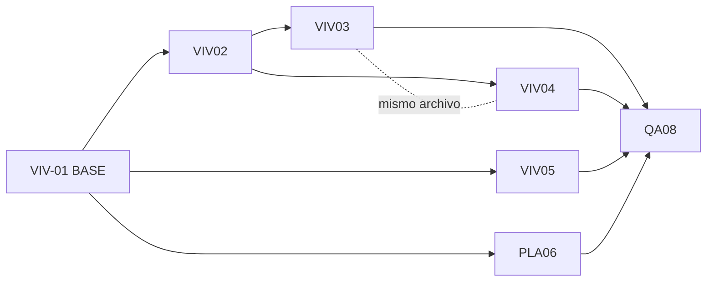

# Tickets — Migración frontend a Asignación física (M2 ↔ M3)

> Deriva de `/Users/pabloandresfernandezcari/Projects/R3foresta/pwa-r3foresta/ANALISIS_MIGRACION_ASIGNACION_FISICA.md` y de la guía de backend
> `/Users/pabloandresfernandezcari/Projects/R3foresta/Backend-r3foresta/documentacion/frontend/guia-migracion-asignacion-fisica.md`.
> **Cambio rompiente y coordinado**: la API nueva rechaza el shape viejo y los campos renombrados
> desaparecen. No shippear a prod sin release conjunto front+back (ver QA-08).

## Tablero rápido

| ID | Título | Prio | Est. | Depende de |
|---|---|---|---|---|
| VIV-01 | Contratos, tipos y mapper (BASE) | P0 | M · 5 | — |
| VIV-02 | Capa API/servicio: devolución + body de asignación | P0 | S · 3 | 01 |
| VIV-03 | Tab asignaciones: asignar (entregar) con evidencia | P0 | L · 8 | 01, 02 |
| VIV-04 | Reemplazar "cancelar" por devolución física | P1 | M · 5 | 01, 02 |
| VIV-05 | Saldos, indicadores y tarjetas (semántica física) | P1 | M · 5 | 01 |
| PLA-06 | Plantación: composición asignada + stock + copy | P1 | M · 5 | 01 |
| PLA-07 | (Backlog) Registro de plantación M3 (consumos) | P2 | L | Backend M3 |
| QA-08 | Regresión + despliegue coordinado | P0 | S · 3 | 01–06 |

### Grafo de dependencias

### Reparto sugerido (2–3 devs)

- **Dev A (ruta crítica):** VIV-01 → VIV-02 → VIV-03 → VIV-04. Dueño del núcleo de asignaciones (mismo archivo en 03/04, evita conflictos).
- **Dev B:** VIV-05 (arranca apenas mergee VIV-01) + apoyo en QA-08.
- **Dev C:** PLA-06 (arranca tras VIV-01 por el tipo de stock) + PLA-07 (backlog).

> **Regla de oro:** VIV-01 se mergea primero y desbloquea a todos. VIV-03 y VIV-04 tocan el mismo
> componente: mismo dev o merge secuencial 03 → 04.

---

## Estado de ejecución (handoff) — actualizado 2026-07-07

**Hecho en `dev` (sin commitear): VIV-01, VIV-02 y VIV-03.** Base tipada + capa API/servicio +
tab de *asignar (entregar) con evidencia*. **Pendiente (lo tomas tú): VIV-04, VIV-05, PLA-06.**

### Nombres backend CONFIRMADOS (2026-07-07)

- `GET /lotes-vivero/stock/especies` → a nivel especie: **`saldo_asignado_subcampanias_total`** (con `_total`). Aplicado en `EspecieStockVivero` (`services/lotes-vivero.service.ts`).
- `GET /lotes-vivero` y `/:id` → dentro de `lotes[]`: **`saldo_asignado_subcampanias`** (sin `_total`). Aplicado en `LoteViveroItem` (`vivero/types/contracts.ts`).
- Respuesta de **asignación**: `data.lote_finalizado` (boolean, normalizado por Nest) **+ `data.motivo_cierre`** → tipo `CrearAsignacionViveroResponseData`.
- Respuesta de **devolución**: `data.lote_reabierto` (boolean, normalizado por Nest) → tipo `DevolverAsignacionViveroResponseData`.

### Ya listo para consumir en VIV-04/05/06

- **Devolución (VIV-04) — service y API listos:** `LotesViveroService.devolverAsignacion(loteId, asignacionId, { cantidad_devuelta, motivo_devolucion, fecha_devolucion })` → `DevolverAsignacionViveroResponseData` (con `lote_reabierto`). API: `devolverAsignacionApi` = `POST /lotes-vivero/:id/asignaciones/:asignacionId/devolucion`. Valida `cantidad_devuelta > 0`, `motivo` y `fecha`. El 422/403 de permisos ya se mapea a mensaje dedicado (`mapAsignacionError`).
- **Placeholder de devolución en la UI (VIV-04):** en `ViveroLotAsignacionesTab.tsx`, el footer de cada tarjeta de asignación tiene un botón **"Devolver al vivero" deshabilitado** ("estara disponible pronto"). Ahí va el form: cantidad parcial (máx = `saldo_asignado_disponible`), motivo, fecha → llamar `devolverAsignacion` → manejar `lote_reabierto` → `onLoteChanged()`. Ya se removió `handleCancel`/`cancelarAsignacion`.
- **Refresco de detalle:** `useViveroDetail` expone `refetch` (silencioso, sin flash). El tab recibe `onLoteChanged` y lo llama tras asignar; reúsalo en devolución.
- **Aliases @deprecated a ELIMINAR en VIV-05:** en `view-models.ts` quedaron `saldoAsignadoTotal` y `saldoVivoDisponibleAsignacion` como alias (mapeados en `lote.mapper.ts`) para que las vistas de saldos compilen sin tocarlas. VIV-05 = migrar esas vistas a `saldoAsignadoSubcampanias` (+ derivar "disponible" de `saldoVivoActual`) y **borrar los 2 alias + su mapeo**.
- **TODOs de compat mínima ya dejados (buscar el comentario):**
  - `ViveroEventScreen.tsx` (~L69) y `DespachoForm.tsx` (~L43-44): `saldoLibre = saldoVivo` provisional; rediseño de labels de despacho = VIV-05.
  - `CatalogoEspeciesPicker.tsx` (~L95): fuente ya cambiada a `saldo_vivo_actual_total`; el copy/UX de PLA-06 sigue pendiente.
  - `composicion_reservada` / `ComposicionReservadaItem` en `plantacion/types/contracts.ts` (L180, L238) y `DetalleSubcampanaScreen.tsx` (L901-903) **siguen sin renombrar** → PLA-06.

> **Verificación VIV-01/02/03:** `tsc -b` limpio (0 errores), lint sin cambios netos (43=43, deuda preexistente), grep sin referencias vivas a `saldo_asignado_total` / `saldo_vivo_disponible_asignacion` / `saldo_disponible_total` / `saldo_reservado_total` ni llamadas `DELETE`. El `npm run build` completo se corre en macOS (el sandbox no bundlea).

---

## VIV-01 — Migrar contratos, tipos y mapper al modelo de asignación física (BASE)

**Prioridad:** P0 · **Estimación:** M (5 pts) · **Depende de:** — · **Bloquea:** 02, 03, 04, 05, 06

**Contexto.** Los tipos del front reflejan el modelo viejo de "reserva lógica". Es la base tipada de
toda la migración; sin esto, el resto no compila contra los nombres nuevos. Ticket **solo de tipos**:
no cambia lógica de UI.

**Alcance.**
- `/Users/pabloandresfernandezcari/Projects/R3foresta/pwa-r3foresta/src/modules/vivero/types/contracts.ts`
  - `LoteViveroItem` (L95–96): `saldo_asignado_total?` → `saldo_asignado_subcampanias?`; **eliminar** `saldo_vivo_disponible_asignacion?`.
  - `CrearAsignacionViveroRequest` (L382–386): `proposito` pasa a **requerido**; añadir `fecha_asignacion: string` (ISO) y `evidencia_ids: number[]` (≥1).
  - Añadir `DevolucionAsignacionRequest { cantidad_devuelta: number; motivo_devolucion: string; fecha_devolucion: string }`.
  - Añadir responses tipadas de asignación y devolución con `lote_finalizado: boolean` (asignación) y `lote_reabierto: boolean` (devolución).
- `/Users/pabloandresfernandezcari/Projects/R3foresta/pwa-r3foresta/src/modules/vivero/types/view-models.ts` (L23–25, L58–60): en `ViveroLotCardData` y `ViveroLotDetailView` renombrar `saldoAsignadoTotal` y **eliminar** `saldoVivoDisponibleAsignacion` (el "disponible" se deriva de `saldoVivoActual`).
- `/Users/pabloandresfernandezcari/Projects/R3foresta/pwa-r3foresta/src/modules/vivero/mappers/lote.mapper.ts` (L96–97, L141–143): mapear al nombre nuevo; dejar de mapear el campo eliminado.
- `/Users/pabloandresfernandezcari/Projects/R3foresta/pwa-r3foresta/src/services/lotes-vivero.service.ts`
  - `EspecieStockVivero` (L93–101) + `listStockEspecies` (L440–473): `saldo_reservado_total` → `saldo_asignado_subcampanias_total` (informativo) y `saldo_disponible_total` → `saldo_vivo_actual_total` (asignable). ⚠️ ruptura silenciosa (hoy queda en 0).
  - Corregir *mojibake* de mensajes de error (L499–535: `inválido`, `subcampaña`, `asignación`).

**Criterios de aceptación.**
- [ ] `npm run build` compila sin referencias a `saldo_asignado_total`, `saldo_vivo_disponible_asignacion`, `saldo_disponible_total`, `saldo_reservado_total`.
- [ ] Existen `DevolucionAsignacionRequest` y las responses con `lote_finalizado` / `lote_reabierto`.
- [ ] `CrearAsignacionViveroRequest` obliga `evidencia_ids`, `fecha_asignacion` y `proposito`.
- [ ] Mensajes de error sin *mojibake*.

**Notas.** ✅ HECHO. Nombre confirmado con backend (2026-07-07): stock/especies usa `saldo_asignado_subcampanias_total` (con `_total`) y el ítem de lote usa `saldo_asignado_subcampanias` (sin `_total`). Ambos aplicados.

---

## VIV-02 — Capa API/servicio: devolución física y body de asignación

**Prioridad:** P0 · **Estimación:** S (3 pts) · **Depende de:** 01 · **Bloquea:** 03, 04

> ✅ **HECHO (dev).** `cancelarAsignacionApi` eliminado; `devolverAsignacionApi` + `devolverAsignacion` creados; `crearAsignacion` valida evidencia/fecha y devuelve `lote_finalizado`; helper 422 permisos; mojibake corregido.

**Alcance.**
- `/Users/pabloandresfernandezcari/Projects/R3foresta/pwa-r3foresta/src/api/lotes-vivero.api.ts`
  - **Eliminar** `cancelarAsignacionApi` (L274–283, `DELETE`).
  - Añadir `devolverAsignacionApi(loteId, asignacionId, input, authId)` → `POST /lotes-vivero/:id/asignaciones/:asignacionId/devolucion`.
  - `crearAsignacionApi` (L262–272): misma firma; envía el body ampliado por tipo.
- `/Users/pabloandresfernandezcari/Projects/R3foresta/pwa-r3foresta/src/services/lotes-vivero.service.ts`
  - `crearAsignacion` (L493–517): exigir `evidencia_ids.length ≥ 1` y `fecha_asignacion` antes de llamar; devolver la response nueva (con `lote_finalizado`).
  - Reemplazar `cancelarAsignacion` (L519–537) por `devolverAsignacion(...)`: valida `cantidad_devuelta > 0`, devuelve `lote_reabierto`.
  - Helper para mapear el 422 de permisos (ADMIN/COORDINADOR) a un mensaje reutilizable.

**Criterios de aceptación.**
- [ ] No queda ninguna llamada `DELETE` a asignaciones en el código.
- [ ] `crearAsignacion` rechaza en cliente si faltan fotos/fecha (sin depender del 422).
- [ ] `devolverAsignacion` mapea `cantidad_devuelta`, `motivo_devolucion`, `fecha_devolucion` y expone `lote_reabierto`.

---

## VIV-03 — Tab de asignaciones: asignar (entregar) plantas con evidencia

**Prioridad:** P0 · **Estimación:** L (8 pts) · **Depende de:** 01, 02 · ⚠️ mismo archivo que VIV-04

> ✅ **HECHO (dev).** Flujo 2 pasos (evidencia → entregar), `maxAsignable = saldo_vivo_actual`, tarjetas físicas "En vivero / Entregado a subcampanias", copy migrado, manejo de `lote_finalizado`, refresco vía `onLoteChanged`. La devolución quedó como botón **deshabilitado** (frontera VIV-04).

**Contexto.** `ViveroLotAsignacionesTab.tsx` es el núcleo del módulo. Hoy asigna **sin fotos** y con
cálculo de saldo viejo (`vivo − reservado`). Ahora asignar = **entregar físicamente**, exige evidencia
y baja el saldo vivo del lote.

**Alcance** (`/Users/pabloandresfernandezcari/Projects/R3foresta/pwa-r3foresta/src/modules/vivero/components/ViveroLotAsignacionesTab.tsx`).
- `maxAsignable` (L143–158): usar **`saldo_vivo_actual` directo**; eliminar `saldoReservadoBackend`/`saldoLibreBackend`.
- `handleCreate` (L206–245): añadir **Paso 1 — subir evidencia** (reusar `LotesViveroService.uploadEvidenciasPendientes`, 1–5 fotos JPG/PNG ≤5 MB → `evidencia_ids`), luego **Paso 2 — asignar** con `fecha_asignacion` (default hoy) + `evidencia_ids`.
- Manejar `lote_finalizado: true` en la response (el lote quedó FINALIZADO por entrega total → reflejarlo en UI y refrescar detalle).
- Manejar 422 de permisos con mensaje dedicado ("Necesitas ser ADMIN o coordinador de la subcampaña").
- Tarjetas de saldo (L284–298): rediseñar a semántica física ("En vivero" / "Entregado a subcampañas"); quitar "Libre = vivo − reservado".
- Copy (L29–47 hints de PROPÓSITOS, L196–204, L305–325, L403–415): "reservar/reserva" → "asignar/entregar". Ver glosario.

**Criterios de aceptación.**
- [ ] No se puede asignar sin al menos 1 foto válida.
- [ ] El máximo asignable = `saldo_vivo_actual` del lote.
- [ ] Tras entregar, al refrescar, el saldo vivo del lote baja.
- [ ] Si `lote_finalizado`, la UI muestra el cierre del lote.
- [ ] Textos sin lenguaje de "reserva/libre".

**Notas.** Coordinar branch con VIV-04 (mismo archivo). Reusar `CantidadStepper` y el patrón de subida de evidencia ya usado en los otros eventos del vivero.

---

## VIV-04 — Reemplazar "cancelar reserva" por devolución física

**Prioridad:** P1 · **Estimación:** M (5 pts) · **Depende de:** 01, 02 · ⚠️ mismo archivo que VIV-03

> ▶ **PENDIENTE (tú).** Base ya lista: `devolverAsignacion`/`devolverAsignacionApi`, placeholder deshabilitado en el tab, `refetch`/`onLoteChanged`. Solo falta el form (cantidad parcial ≤ `saldo_asignado_disponible`, motivo, fecha) + manejo de `lote_reabierto`. Ver "Estado de ejecución (handoff)" arriba.

**Contexto.** "Cancelar asignación" (DELETE, liberaba reserva) ya no existe. Ahora se **devuelve**
stock físico: el saldo del lote sube y puede reabrir un lote finalizado.

**Alcance** (`/Users/pabloandresfernandezcari/Projects/R3foresta/pwa-r3foresta/src/modules/vivero/components/ViveroLotAsignacionesTab.tsx`).
- Reemplazar `handleCancel` + `ConfirmDialog` (L247–265, L491–523) por un **diálogo/form de devolución** con: `cantidad_devuelta` (parcial permitido, máx = `saldo_asignado_disponible`), `motivo_devolucion` y `fecha_devolucion`.
- Quitar la regla `canCancel = cantidad_consumida === 0`: se puede devolver mientras `saldo_asignado_disponible > 0`.
- Manejar `lote_reabierto: true` (mostrar reapertura y refrescar detalle del lote).
- Copy: "Cancelar / Liberar reserva" → "Devolver al vivero".

**Criterios de aceptación.**
- [ ] Devolución **parcial** funciona y refresca saldos (lote sube, asignación baja).
- [ ] Si `lote_reabierto`, la UI refleja la reapertura del lote.
- [ ] Sin llamadas `DELETE`.
- [ ] Sin copy de "reserva".

---

## VIV-05 — Saldos, indicadores y tarjetas de lote (semántica física)

**Prioridad:** P1 · **Estimación:** M (5 pts) · **Depende de:** 01

> ▶ **PENDIENTE (tú).** Clave: eliminar los alias `saldoAsignadoTotal` / `saldoVivoDisponibleAsignacion` de `view-models.ts` **y su mapeo** en `lote.mapper.ts` (usar `saldoAsignadoSubcampanias` + derivar disponible de `saldoVivoActual`), y revertir los `saldoLibre = saldoVivo` provisionales de `ViveroEventScreen.tsx` (~L69) y `DespachoForm.tsx` (~L43-44). Ver handoff arriba.

**Alcance.**
- `/Users/pabloandresfernandezcari/Projects/R3foresta/pwa-r3foresta/src/modules/vivero/utils/dispatchFlow.ts` (L11–14, L20–30, L34–38): rehacer `getDispatchFlowStatus` sin `saldoVivoDisponibleAsignacion`; basar el estado en `saldo_asignado_subcampanias` + `cantidadAsignacionesActivas`; ajustar labels ("Listo para despacho" / "ofrecerse a asignacion") a lenguaje de entrega física.
- `/Users/pabloandresfernandezcari/Projects/R3foresta/pwa-r3foresta/src/modules/vivero/components/ViveroLotCard.tsx` (L59–60, L150–158): "reservado" → "entregado"; **eliminar** "stock libre".
- `/Users/pabloandresfernandezcari/Projects/R3foresta/pwa-r3foresta/src/modules/vivero/components/IndicadoresRapidos.tsx` (L19–20): "Saldo reservado" → "Entregado a subcampañas"; quitar "Saldo libre".
- `/Users/pabloandresfernandezcari/Projects/R3foresta/pwa-r3foresta/src/modules/vivero/screens/ViveroScreen.tsx` (L47, L211): eliminar `stockLibre` derivado del campo removido.
- `/Users/pabloandresfernandezcari/Projects/R3foresta/pwa-r3foresta/src/modules/vivero/screens/ViveroEventScreen.tsx` (L68): idem.
- `/Users/pabloandresfernandezcari/Projects/R3foresta/pwa-r3foresta/src/modules/vivero/components/event/forms/DespachoForm.tsx` (L43–44): actualizar aunque el form siga deshabilitado (`DESPACHO_EVIDENCE_ENDPOINT_READY = false`).

**Criterios de aceptación.**
- [ ] Ninguna vista de vivero referencia `saldoVivoDisponibleAsignacion`/`saldoAsignadoTotal`.
- [ ] Labels sin "reserva/libre".
- [ ] `npm run lint` limpio en los archivos tocados.

---

## PLA-06 — Plantación: composición asignada, stock por especie y copy

**Prioridad:** P1 · **Estimación:** M (5 pts) · **Depende de:** 01 (para `EspecieStockVivero`)

> ▶ **PENDIENTE (tú).** Ya hecho: `CatalogoEspeciesPicker.tsx` (~L95) toma `saldo_vivo_actual_total`. Falta: renombrar `composicion_reservada`→`composicion_asignada` y `saldo_reservado`→`saldo_asignado_disponible` (`plantacion/types/contracts.ts` L180/L238, `DetalleSubcampanaScreen.tsx` L901-903) + copy. Ver handoff arriba.

**Alcance.**
- `/Users/pabloandresfernandezcari/Projects/R3foresta/pwa-r3foresta/src/modules/plantacion/types/contracts.ts` (L180–185, L238): `ComposicionReservadaItem` → `ComposicionAsignadaItem` con `saldo_asignado_disponible`; `ActivarSubcampaniaData.composicion_reservada` → `composicion_asignada`.
- `/Users/pabloandresfernandezcari/Projects/R3foresta/pwa-r3foresta/src/modules/plantacion/screens/DetalleSubcampanaScreen.tsx` (L900–920, `handleActivated`): leer `composicion_asignada` + `saldo_asignado_disponible`; copy "stock reservado" → "entregado/asignado".
- `/Users/pabloandresfernandezcari/Projects/R3foresta/pwa-r3foresta/src/modules/plantacion/components/CatalogoEspeciesPicker.tsx` (L46, L95): `saldo_disponible_total` → `saldo_vivo_actual_total`.
- `/Users/pabloandresfernandezcari/Projects/R3foresta/pwa-r3foresta/src/modules/plantacion/components/SubcampaniaEspeciesStep.tsx` + `utils/subcampaniaDraft.ts`: verificar que `saldo_disponible` se alimenta de la fuente nueva; mantener la validación "excede el stock disponible".
- `SubcampaniaResumenStep.tsx` (L431) + `CancelarSubcampaniaModal.tsx` + `SubcampaniaSuccessOverlay.tsx`: copy — cancelar ahora **devuelve** stock físico al vivero.

**Criterios de aceptación.**
- [ ] El picker de especies muestra stock real (no 0) tras el renombrado.
- [ ] La activación lee la composición asignada correctamente.
- [ ] Copy alineado al glosario.

---

## PLA-07 — (BACKLOG) Registro de plantación M3 (consumos)

**Prioridad:** P2 · **Estimación:** L · **Depende de:** backend M3 disponible

**Contexto.** `POST /registros-plantacion` **no está consumido** por el front todavía. No bloquea el
release M2 actual, pero debe diseñarse ya alineado al contrato nuevo.

**Alcance (cuando se implemente).**
- La response usa `consumos` (no `despachos`).
- Validaciones a manejar: 400 si la especie no está en el plan o el acumulado supera `cantidad_objetivo`; 400 si la reposición excede `muertas − repuestas` del grupo origen.
- La reposición acepta subcampaña `COMPLETADA` / `FINALIZADA_PARCIAL`.

---

## QA-08 — Regresión y despliegue coordinado

**Prioridad:** P0 · **Estimación:** S (3 pts) · **Depende de:** 01–06

**Alcance.**
- Regresión E2E manual: crear lote → embolsado → adaptabilidad → **asignar (con foto)** → **devolver (parcial y total)** → verificar cierre/reapertura del lote.
- `grep` de barrido sin ocurrencias de: `saldo_asignado_total`, `saldo_vivo_disponible_asignacion`, `saldo_disponible_total`, `saldo_reservado`, `composicion_reservada`.
- Coordinar release: la API nueva rechaza el shape viejo → **feature flag o deploy conjunto** front+back. Definir orden con backend (migraciones 051–055).

**Criterios de aceptación.**
- [ ] `grep` sin ocurrencias de los campos migrados.
- [ ] Flujo E2E manual OK contra backend nuevo.
- [ ] Plan de release conjunto acordado con backend.

---

## Glosario de copy (aplicar en 03, 04, 05, 06)

| Antes | Ahora |
|---|---|
| "Reservar stock" / "Crear reserva" | "Asignar (entregar) plantas" |
| "Reservado para subcampañas" / "Saldo reservado" | "Entregado a subcampañas" |
| "Liberar reserva" / "Cancelar asignación" | "Devolver al vivero" |
| "Disponible para reserva" / "Saldo libre" | "Disponible en vivero" |
| Despacho `origen_despacho = ASIGNACION_SUBCAMPANIA` | "Salida por asignación a subcampaña" |
| Evento M2 `DEVOLUCION_PLANTACION` (nuevo) | "Devolución desde plantación (+N)" |
