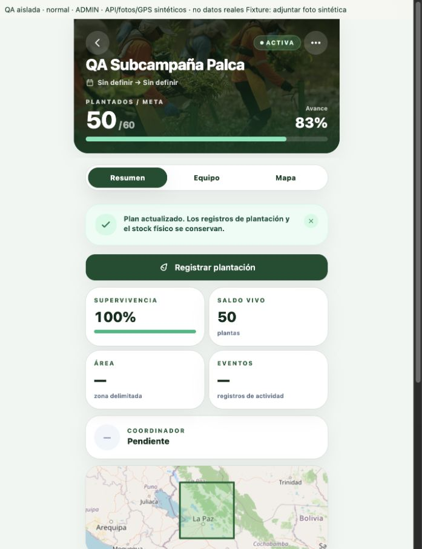
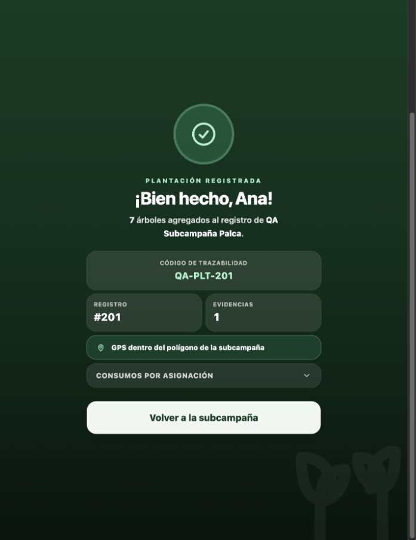

# Pruebas de uso: revisión del plan y plantación

Fecha: 9 de octubre de 2026. Repositorio: `pwa-r3foresta`. Resultado: recorridos frontend verificados con datos aislados; integración con backend/base real pendiente.

## Alcance y método

Se ejecutaron pantallas reales de `DetalleSubcampanaScreen`, `EditarPlanSubcampania`, `CatalogoEspeciesPicker`, cierre manual y `RegistrarPlantacionScreen` en el navegador integrado de Codex. Se conservaron las capas reales de API/servicio y el AuthProvider; una entrada temporal de QA devolvía perfiles y respuestas HTTP sintéticos mediante una fixture de `fetch`. Ninguna llamada API salió hacia un backend real. El mapa puede cargar sus tiles públicos habituales.

Vite se inició solo en `127.0.0.1:5173`, con `VITE_API_URL` local sobrescrito para esa ejecución. La entrada de QA y su token ficticio pertenecían exclusivamente a esa página local; no se agregó un modo de autenticación de prueba al producto. La página y servidor se retiraron al finalizar. No se ejecutaron pruebas de campo con personas ni se acreditó seguridad, migraciones aplicadas, stock físico o persistencia real.

Datos iniciales: subcampaña 54 ACTIVA, meta 40, plantado inicial 50, revisión 2; Queñua como única especie al 100%, stock asignado 7. Molle estaba en catálogo sin stock asignado. Foto PNG sintética y GPS sintético dentro del polígono. Cada escenario reiniciaba la fixture, salvo el recorrido que encadenó revisión y plantación.

El selector de archivos del navegador de automatización no completó dos intentos. Para continuar el recorrido se utilizó un botón exclusivo de la fixture que suministraba un archivo sintético al input real de fotos y disparaba su cambio. Esto verificó selección recibida, validación, resumen y envío, pero **no** el selector nativo, cámara ni permisos GPS de un dispositivo. El GPS se suministró mediante fixture. Los intentos fallidos del selector no se clasifican como fallo demostrado del producto.

## Resultados observados en navegador

| Caso ejecutado | Resultado observado |
|---|---|
| Abrir detalle con 50 plantados/meta 40. | ACTIVA y 125% visibles; progreso numérico por encima de 100%. |
| ADMIN abre editor. | Valores persistidos 40/40/100%; sin recalcularlos automáticamente. |
| Proponer meta 60 y Queñua 60. | Confirmación distingue meta actual 40/propuesta 60 y objetivo actual/propuesto por especie. |
| Confirmar revisión. | Un solo PUT lleva meta, metas y `revision_esperada: 2`; ningún PATCH para dividir la revisión. Botón deshabilitado durante envío. |
| Respuesta de revisión confirmada. | Detalle 50/60 y 83%, ACTIVA; stock de fixture sigue 7. Se consultan detalle, plan, campaña, métricas, resumen global y contexto de plantación. |
| Abrir cierre manual con 50/60. | Ofrece cierre parcial con motivo; rechaza confirmar sin motivo. «Seguir plantando» cancela el cierre y deja ACTIVA. No se envió cierre en este recorrido. |
| Registrar después de revisar plan. | Vuelve a consultar contexto y muestra Queñua 50/60, pendiente 10 y stock 7. |
| Introducir 8 con stock 7. | Rechaza avanzar con «Supera el stock asignado disponible (7)»; conserva 8 para corregirlo. |
| Corregir a 7 y confirmar. | Resumen con foto/GPS/especie/cantidad; una subida de evidencia y un POST de registro. Comprobante `QA-PLT-201`, 7 árboles y una evidencia. Fixture termina plantado 57, stock 0, ACTIVA. |
| Conflicto 409: otro ADMIN cambió meta a 45/revisión 3. | Conserva propuesta 60; impide guardar y pide consultar plan vigente. No reintenta automáticamente. |
| Consultar plan después del 409 y volver a revisar. | Baseline actual 45 y propuesta 60 intacta. Tras nueva revisión/confirmación envía revisión esperada 3 y muestra 50/60. Exactamente dos PUT: uno rechazado y uno confirmado por el usuario. |
| Agregar Molle desde catálogo. | Queñua ya elegida se excluye; Molle seleccionable con disponibilidad 0. No se exige stock para planificarla. |
| Cantidad decimal `45.5`, porcentajes 75+20 y cantidades 45+14/meta 60. | Rechazos respectivos de entero positivo, suma 100% y suma de cantidades; valores conservados y sin PUT hasta corregir. |
| Guardar dos especies: Queñua 45/75%, Molle 15/25%, meta 60. | Confirmación identifica Molle como agregada. Plantación usa plan revisado; Queñua muestra 50/45 y stock 7. Molle muestra 0/15 y stock 0, con contador deshabilitado. Añadir al plan no habilita consumo sin stock. |
| Backend responde 403 durante guardado. | Mantiene propuesta 60, informa permiso rechazado y bloquea confirmar. |
| Backend cambia a COMPLETADA y responde 422. | Consulta plan vigente, conserva propuesta 60 y deshabilita edición/confirmación por estado. El encabezado exterior conserva el último estado leído: ver hallazgo inferior. |
| Perfil GENERAL abre opciones. | No aparece acción de editar meta/especies ni cierre ADMIN. No se envía revisión. |
| Retirar Queñua y sustituirla por Molle. | 422 con explicación de plantación/stock; mantiene propuesta Molle 40/100% y muestra error. El plan original permanece en la fixture. Esta prueba acredita representación del rechazo; la protección real requiere backend integrado. |

Las respuestas sintéticas ejercitan el comportamiento de la PWA; no comprueban que un servidor real cumpla esos invariantes. Deshabilitar el botón y observar un PUT tampoco acredita idempotencia durable del registro físico.

## Evidencia de llamadas

En el caso normal, el único request de revisión fue:

```json
{
  "meta_total_arboles": 60,
  "metas": [
    { "planta_id": 10, "cantidad_objetivo": 60, "porcentaje_objetivo": 100 }
  ],
  "revision_esperada": 2
}
```

Tras el éxito se observaron GET de `/api/subcampanias/54`, `/plan`, `/api/campanias/20`, `/metrics`, `/api/campanias/resumen` y `/api/subcampanias/54/plantacion/context`. Entrar al registro produjo otro GET del contexto. La plantación de 7 envió un detalle con asignación 101, lote 99, especie 10 y evidencia 12. El responsable no se eligió como campo editable.

En consola se observaron avisos de transición futura de React Router v7. El recorrido no requirió cambios de código productivo.

## Verificación automática ejecutada

| Comando | Resultado |
|---|---|
| `npm run test` | 17 archivos y 149 pruebas pasan; duración reportada 6,88 s. Incluye editor, contrato/API de plan, wizard, detalle, cierre y plantación; también las regresiones existentes de Auth/Recolección/Vivero. |
| `npm run lint` | Lint completo del repositorio pasa, salida sin errores. |
| `npm run build` | TypeScript, Vite y generación PWA pasan; 2034 módulos transformados, 104 entradas precache. |

No existe script `typecheck`; la comprobación TypeScript se ejecuta en `build` mediante `tsc -b`. Las pruebas automáticas de cierre cubren su envío/validación, mientras el navegador de esta sesión verificó apertura, motivo obligatorio y cancelación con la meta revisada.

Los escenarios tienen cobertura reproducible en `EditarPlanSubcampaniaModal.test.tsx`, `EditarPlanSubcampania.test.tsx`, `DetalleSubcampanaPlan.test.tsx`, `SubcampaniaEspeciesStep.test.tsx`, `RegistrarPlantacionScreen.test.tsx`, `plantacion.plan.test.ts` y los tests de cierre. La entrada temporal de navegador no constituye una suite E2E incorporada a CI.

## Hallazgos de uso y límites

- La comparación antes de guardar y la conservación de propuesta facilitan corregir errores sin reingresar todo. El caso 409 exige una nueva revisión explícita y comunica claramente la acción siguiente.
- El acceso está en «Más opciones». Se verificó que ADMIN puede encontrarlo por ese recorrido, pero no se midió descubribilidad con una persona de campo sin instrucciones.
- La lectura de cantidades/stock mantiene la distinción entre planificación y material disponible. Queñua sobre su objetivo continúa operable con el flag backend; Molle sin stock no permite registrar.
- **AUD-016:** si el servidor cierra la subcampaña mientras se edita, el editor recibe el estado nuevo y bloquea la operación, pero el encabezado de detalle puede conservar ACTIVA hasta recargar. Reconciliar el detalle con ese cambio es una mejora pendiente; no se observó guardado permitido tras el rechazo.
- Para el futuro LCO, el resumen «Solo tú» significa que no se declararon corresponsables; no demuestra que la persona haya plantado físicamente sola. Revisar esa presentación al adaptar participantes históricos.
- Continúa **AUD-015**: validar los mismos recorridos en staging con backend y migración 062, actores controlados, concurrencia y datos consistentes. Comprobar persistencia, stock y campaña en la base real; este informe no reemplaza esa integración.

## Capturas

Detalle después de revisar el plan: datos sintéticos, ACTIVA, 50/60 y 83%.



Comprobante de plantación de 7 con evidencia/GPS sintéticos.



Para pros/contras, reutilización, dependencias y fases del nuevo incremento, consultar [ANALISIS_LCO_PLANTACION.md](ANALISIS_LCO_PLANTACION.md). Ese documento es análisis; no implementa LCO.
